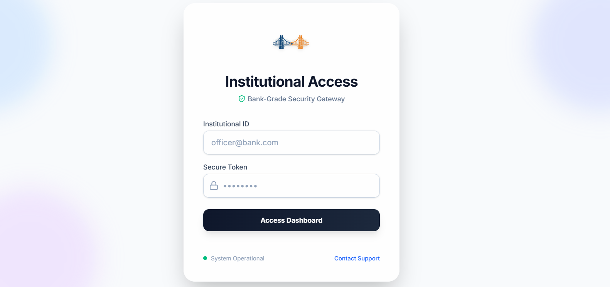
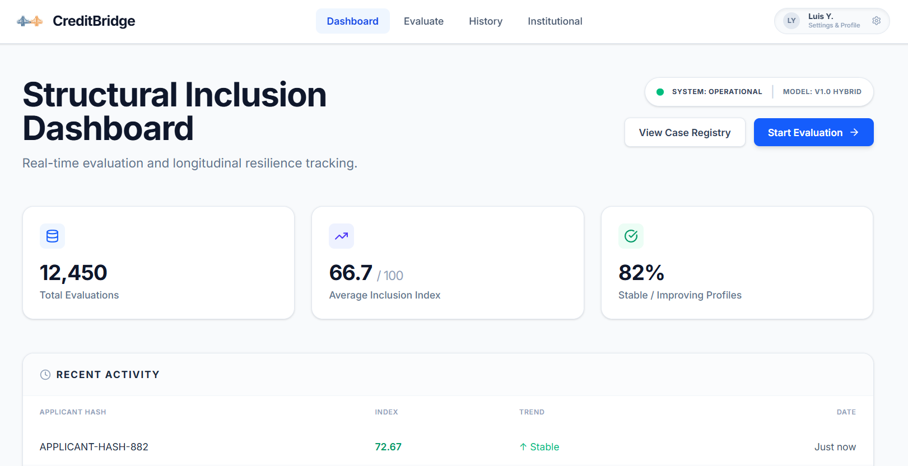
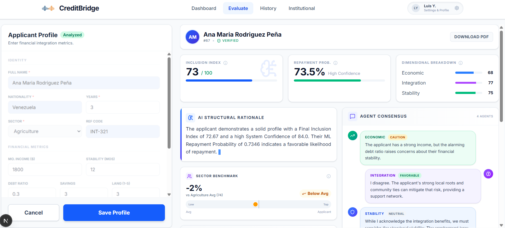
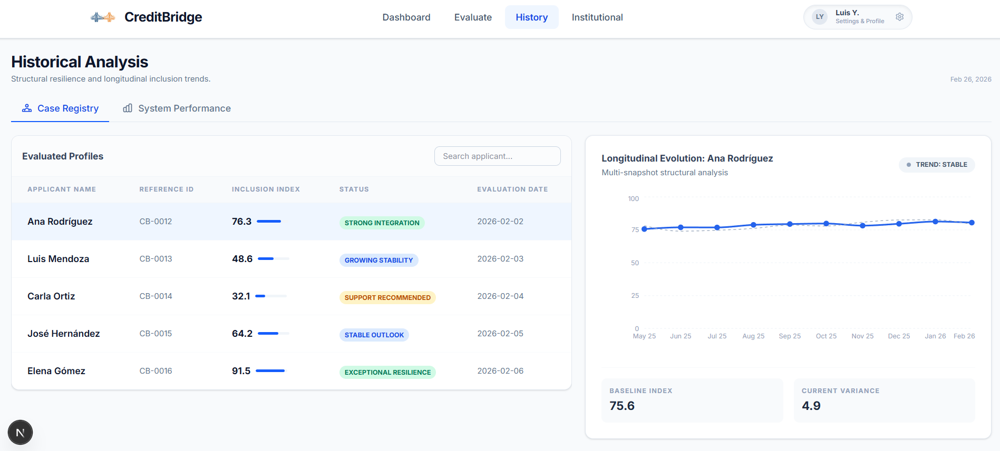
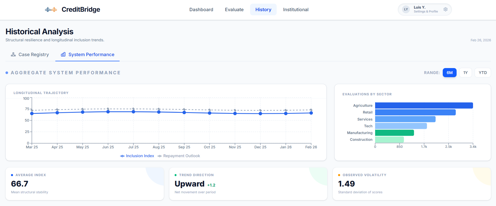

# MCP CreditBridge

**MCP CreditBridge** es una plataforma integral orientada a la evaluación de riesgo crediticio y la inclusión financiera. A través de una arquitectura innovadora que combina modelos matemáticos deterministas con Inteligencia Artificial Generativa (un Sistema Multi-Agente), la aplicación evalúa perfiles de crédito no tradicionales, ofreciendo decisiones y recomendaciones transparentes.

## Características Principales

- 🤖 **Sistema Multi-Agente:** Evaluadores especializados (Económico, Auditor, Prescriptivo, Moderador, etc.) analizan el perfil de múltiples ángulos.
- 📊 **Scoring Inclusivo:** Cálculos matemáticos específicos (como el Índice de Inclusión) enfocados en democratizar el acceso al crédito.
- ⚡ **Backend de Alto Rendimiento:** Construido sobre **FastAPI** para respuestas asíncronas y rápidas.
- 🌐 **Frontend Moderno:** Interfaz web fluida, interactiva y estéticamente depurada desarrollada en **Next.js / React**.
- 🧠 **LLM Agnóstico:** Integración con **LiteLLM** que permite utilizar modelos de OpenAI, Anthropic, Google o despliegues locales sin cambiar el código base.

---

## Galería de la Plataforma

A continuación se presentan capturas del sistema en funcionamiento:

- **Landing Page Inicial**: La página principal de presentación del proyecto.
  

- **Login**: Sistema de acceso básico inicial.
  

- **Dashboard General**: Pantalla posterior al logeo mostrando métricas clave, el índice de inclusión global y últimas evaluaciones de la institución.
  

- **Análisis de Crédito**: Vista detallada de una evaluación crediticia estructurando métricas y la interpretación narrativa generada por los agentes LLM.
  

- **Historial Crediticio**: Seguimiento visual en línea de tiempo de los solicitantes analizados.
  

- **Análisis Compuesto**: Vista de métricas globales distribuidas estratégicamente por sectores.
  

---

## Estructura del Proyecto

El repositorio está dividido en dos partes principales:

1. **`backend/`**: Contiene la API, los esquemas de bases de datos, los agentes de IA y los motores de cálculo algorítmico.
   *(Para una vista detallada de los submódulos, revisa la [Documentación Granular del Backend](backend/README.md))*
2. **`frontend/`**: Contiene la interfaz de usuario web interactiva.

---

## Requisitos Previos

Asegúrate de tener instalados los siguientes componentes antes de iniciar:

- **Python 3.9+** (Para el Backend)
- **Node.js 18+** y **npm** (Para el Frontend)
- **Git** (Para clonar y gestionar el repositorio)

---

## Instalación y Ejecución

Para levantar el proyecto completo en tu entorno local, debes ejecutar ambos entornos (Backend y Frontend) por separado.

### 1. Configuración del Backend

Abre tu terminal y navega a la carpeta del backend:
```bash
cd backend
```

Crea y activa tu entorno virtual:
```bash
# Windows
python -m venv venv
venv\Scripts\activate

# Linux/Mac
python3 -m venv venv
source venv/bin/activate
```

Instala las dependencias:
```bash
pip install -r requirements.txt
```

Configura tus variables de entorno:
1. Copia el archivo de ejemplo: `cp .env.example .env`
2. Abre el `.env` y coloca tu(s) API Key(s) necesarias (Ej. OpenAI).

Inicia el servidor backend:
```bash
uvicorn app.main:app --reload
# El servidor correrá en http://localhost:8000
```

### 2. Configuración del Frontend

Abre otra pestaña en tu terminal y navega a la carpeta del frontend:
```bash
cd frontend
```

Instala los paquetes de Node:
```bash
npm install
```

Configura tus variables de entorno para el navegador:
1. Copia el archivo de ejemplo: `cp .env.local.example .env.local`
2. Verifica que `NEXT_PUBLIC_API_URL` apunte a tu servidor backend en el puerto 8000.

Inicia el entorno de desarrollo web:
```bash
npm run dev
# El sitio web correrá en http://localhost:3000
```

---

## Equipo / Organización
Desarrollado para **Economía UNMSM**.
Repositorio: [https://github.com/EconomiaUNMSM/MCP-CreditBridge](https://github.com/EconomiaUNMSM/MCP-CreditBridge)
